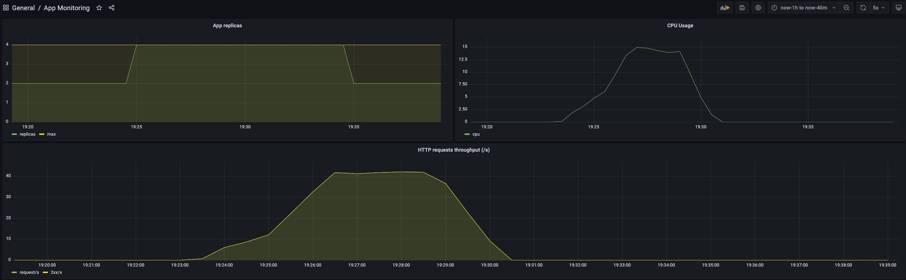

### Benchmark

Simple APP benchmark using [drill](https://github.com/fcsonline/drill)

You can revise the bechnmark scenario in `benchmark.yaml`. The default one will perform 10_000 requests with at most 100 threads.

```bash
drill --benchmark benchmark.yaml --stats
```

### Results

For this benchmark all requests were successfully answered by the APP but the median latency increases significantly (about 5 times the low load latency).


We can see that the APP automatically scaled upon the growing load to come back to the normal a while after.



For this benchmark a unique pod of the app is instantiated with 4vCore and 4GB of memory and is scaled by default at 2 replicas. 
The autoscaler allows the deployment to scale up to 4 replicas.